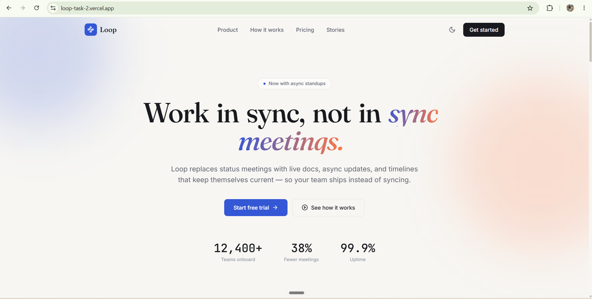

# Loop — Animated Landing Page

A modern, animated marketing landing page for "Loop" (a fictional async-work
SaaS product), built with React, Vite, Tailwind CSS, and Framer Motion.



## Live demo

**[Add your Vercel URL here after deploying]**

## Requirements coverage

The brief asked for at least five of the following — this implements all
fourteen:

| Requirement | Where |
|---|---|
| Responsive navbar | `components/layout/Navbar.jsx` — collapses to a mobile menu with animated height transition |
| Animated hero | `components/sections/Hero.jsx` — word-by-word headline reveal, staggered CTA/stat entrance |
| Smooth scrolling | `index.css` (`scroll-behavior: smooth`) + anchor-linked nav |
| Scroll reveal | `components/ui/Reveal.jsx` — Framer Motion `whileInView`, used across every section |
| Parallax | Hero background orbs move at different scroll-linked speeds (`useScroll` + `useTransform`) |
| Animated counters | `components/ui/AnimatedCounter.jsx` — spring-driven count-up, triggers once in view |
| Timeline | `components/sections/Process.jsx` — connecting line draws in as you scroll |
| Interactive cards | `components/sections/Features.jsx` — lift + shadow + icon scale on hover |
| Testimonials | `components/sections/Testimonials.jsx` |
| Pricing | `components/sections/Pricing.jsx` — monthly/yearly toggle, highlighted tier |
| Validated contact form | `components/sections/Contact.jsx` — inline validation, blur + submit checks, success state |
| Dark/light theme | `context/ThemeContext.jsx` — persisted to `localStorage`, respects system preference on first load, no flash-of-wrong-theme (inline script in `index.html`) |
| Scroll progress indicator | `components/layout/ScrollProgress.jsx` — fixed top bar, spring-smoothed |
| Responsive design | Every section, tested down to 360px |

## Tech stack

| Layer | Choice |
|---|---|
| Framework | React 18 (functional components + hooks) |
| Build tool | Vite |
| Styling | Tailwind CSS (custom design tokens, class-based dark mode) |
| Animation | Framer Motion |
| Icons | lucide-react |
| Fonts | Fraunces (display/serif headlines), Inter (body), JetBrains Mono (stats/numbers) |

## Folder structure

```
src/
├── components/
│   ├── layout/       # Navbar, Footer, ScrollProgress — persistent chrome
│   ├── sections/      # Hero, Features, Process, Testimonials, Pricing, Contact
│   └── ui/            # Reveal, AnimatedCounter — reusable primitives
├── context/
│   └── ThemeContext.jsx
├── data/
│   └── content.js      # All copy/content in one place — edit here, not in components
├── App.jsx
├── main.jsx
└── index.css
```

## Getting started

```bash
npm install
npm run dev       # http://localhost:5173
npm run build     # production build to /dist
npm run preview   # preview the production build
```

## Design notes

- **Palette**: cobalt blue (`#3457D5`) as the primary action color, ember
  orange (`#FF7A45`) as a warm accent used sparingly (section labels,
  gradient text, save-badges) — not a generic purple SaaS gradient.
- **Type pairing**: Fraunces (a warm, editorial serif) for headlines against
  Inter for body copy — chosen to avoid the default geometric-sans-on-sans
  look most landing pages default to. JetBrains Mono is reserved for numeric
  data (stats, prices) to visually separate "data" from "copy."
- **Dark mode** uses Tailwind's class strategy; a small inline script in
  `index.html` reads the stored preference before React mounts, so there's
  no flash of the wrong theme on load.

All tokens live in `tailwind.config.js` — change colors/fonts there.

## Deployment

Static Vite build — deploys to any static host.

**Vercel**
```bash
npm i -g vercel
vercel
```

**Netlify**
```bash
npm run build
# drag-and-drop /dist at app.netlify.com/drop
```

## Screenshots

Add screenshots to `/screenshots` before publishing (desktop, tablet, mobile,
and one of the dark theme).
- `dashboard-desktop.png`
- `dashboard-tablet.png`
- `dashboard-mobile.png`

## License

MIT
